# MIPT Conference 2023 

This is representation of the pipeline (code could be found in Conference.Rmd) of my work presented on the conference at MIPT in April 2023. The details about data is described in the presentation. Here you can see the code of the work.


```r
library(edgeR)
library(psych)
library(DESeq2)
library(amap)
library(dplyr)
set.seed(1)
```


```r
filtrate <- function(Expr, tumor, liver,
                     mintum = 10, minliv = 10){
  #This function filtrates genes by their
  #expression in some minimum number of samples. 
  #This is done to reduce the number of genes
  #and to avoid some dimensional troubles
  Tumor <- Expr[,tumor]
  Liver <- Expr[,liver]
  Tumor <- cpm(Tumor) > 1
  Tumor <- rownames(Expr)[which(rowSums(Tumor) >= mintum)]
  Liver <- cpm(Liver) > 1
  Liver <- rownames(Expr)[which(rowSums(Liver) >= minliv)]
  keep <- intersect(Tumor,Liver)
}
```

Reading the data and concatating count matrices of samples


```r
Expr1 <- read.csv('salmon.merged.gene_counts.tsv', sep = '\t')
Expr2 <- read.csv('salmon.merged.gene_counts2.tsv',sep = '\t')
groupstab <- read.csv('sample_data.csv')
rownames(groupstab) <- groupstab$name
Expr1<- merge(x = Expr1,y = Expr2, by = "gene_id")
rownames(Expr1) <- Expr1$gene_id
Expr1 <- Expr1[,-c(1,78)]
```

The same is done with cell lines


```r
CL1 <- read.csv('cell_lines_counts1.tsv', sep = '\t')
CL2 <- read.csv('cell_lines_counts2.tsv',sep = '\t')
groupstab1 <- read.csv('Cell_line_collection.csv')
CL_annot <- groupstab1$Cell.line
names(CL_annot) <- groupstab1$SRR
CL1[,colnames(CL2)] <- CL2
rownames(CL1) <- CL1$gene_id
CL_gene_an <- CL1[,c(1,2)]
CL1 <- CL1[,-c(1,2)]
```

## Gene filtration


```r
Expr_gene_an <- Expr1$gene_name
names(Expr_gene_an) <- rownames(Expr1)
Expr <- Expr1
Expr[,colnames(CL1)] <- CL1[rownames(Expr),]
Expr <- na.omit(Expr)
keep <- filtrate(Expr[,-1], 
                 rownames(groupstab[which(groupstab$sample_type == "op"),]),
                 rownames(groupstab[which(groupstab$sample_type == "pech"),]),
                 20, 20)
Expr.filt <- Expr[keep,-1]
#Some of the cell lines samples are outliers so we need to get rid of them
Expr.filt <- Expr.filt[,-which(colnames(Expr.filt) 
                               %in% c("SRR19909308","SRR19909310",
                                      "SRR19909307", "SRR12144191"))]
```

Annotation table for groups


```r
group_full <- append(groupstab$sample_type,groupstab1$Cell.line)
groups <- as.character(dplyr::recode(as.factor(group_full),
                             HUH7 = 'H7', HepG2 = 'HG2',
                             Hep3B = 'H3B', op = 'T',
                             pech = 'L'))
groups <- as.data.frame(groups)
rownames(groups) <- append(rownames(groupstab),groupstab1$SRR)
names(group_full) <- append(rownames(groupstab),groupstab1$SRR)
```


```r
groups <- groups[colnames(Expr.filt),]
Expr.filt <- DGEList(Expr.filt, 
                     samples = colnames(Expr.filt),
                     genes = rownames(Expr.filt),
                     group = unlist(groups, use.names = FALSE))
Expr.filt<- Expr.filt[filterByExpr.DGEList(Expr.filt),]
Expr.filt <- calcNormFactors(Expr.filt,method = 'TMM')
```


```r
Expr.filt <- estimateCommonDisp(Expr.filt,verbose = T)
```

```
## Disp = 0.34624 , BCV = 0.5884
```

```r
Expr.filt <- estimateTagwiseDisp(Expr.filt)
```


```r
group_full <- as.character(dplyr::recode(as.factor(group_full),
                             HUH7 = 'HUH7', HepG2 = 'HepG2',
                             Hep3B = 'Hep3B', op = 'Tumor',
                             pech = 'Liver'))
group_full <- as.data.frame(group_full)
rownames(group_full) <- append(rownames(groupstab),groupstab1$SRR)
```


```r
cols <- c('Tumor' = 'red',
          'Liver' = 'blue',
          'Hep3B' = 'green4',
          'HUH7' = 'orange',
          'HepG2' = 'purple')

labs_ext <- group_full[colnames(Expr.filt),]
plotMDS.extended <- function(Expr, labs_ext, labs, cols){
  plotData <- plotMDS(Expr, top = 1000, plot = F)
  PD <- data.frame(row.names = colnames(Expr))
  PD$x <- plotData$x 
  PD$y <- plotData$y 
  PD$labs <- labs
  PD$Sample <- labs_ext
  xl <- as.character(round(plotData$var.explained[1], digits = 2)*100)
  xl <- paste(c(plotData$axislabel,'1 (',xl,'%)'),collapse = '')
  yl <- round(plotData$var.explained[2], digits = 2)*100
  yl <- paste(c(plotData$axislabel,'2 (',yl,'%)'),collapse = '')
  my_theme <- ggplot2::theme(axis.title.x = element_text(size = 16),
                    #axis.text.x = element_text(size = 14),
                    axis.title.y = element_text(size = 16),
                    legend.text = element_text(size = 12),
                    legend.title = element_text(size = 16))
  ggp <- ggplot(PD, aes(x = x, y = y)) + geom_point(aes(color = Sample)) + scale_color_manual(values = cols) + xlab(xl) + ylab(yl) #+ my_theme
  return(ggp)
}
```

Here you can see plot for 7-th slide


```r
library(ggplot2)
plotMDS.extended(Expr.filt, col = cols, labs = groups, labs_ext = labs_ext)
```

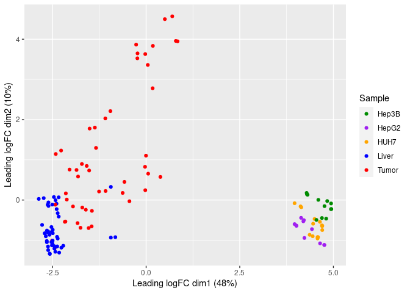<!-- -->


As you can see, unlike Liver(normal tumor-associated tissue) and Cell lines, Tumor samples are widespread in this plot and form at least two clusters. To define them I performed hierarchical clusterization on pearsons absolute correlation.

## Genes to clusterize

I defined the most diffexpressed genes between Tumor and Liver to compute pearsons correlation.


```r
LivT <- exactTest(Expr.filt, c(4,5))
lit <- decideTestsDGE(LivT, adjust.method = "BH", lfc = 0.5, p.value = 0.01)
li <- rownames(Expr.filt)[as.logical(lit)]
```


```r
library(patchwork)
volcplot <- function(ExaT, name, logfc, pval,
                     rotate = T, color_lab = c('blue', 'black', 'red'), oneside = F, MD = F){
  volcdat <- as.data.frame(ExaT$table)
  volcdat$Regulation <- decideTestsDGE(ExaT,  adjust.method = "BH",
                                       lfc = logfc, p.value = pval)@.Data
  samples <- strsplit(name, ' vs ')[[1]]
  reg_lab <- c(paste(c('Upreg in',samples[1]),collapse = ' '),
               'Not significant', 
               paste(c('Upreg in',samples[2]),collapse = ' '))
  #print(head(reg_lab))
  if (oneside){
    color_lab <- c('black', 'black', 'red')
    reg_lab <- c('Not significant',
               'Not significant', 
               paste(c('Upreg in',samples[2]),collapse = ' '))}
  my_theme <- theme(axis.title.x = element_text(size = 16),
                    #axis.text.x = element_text(size = 14),
                    axis.title.y = element_text(size = 16),
                    legend.text = element_text(size = 12),
                    legend.title = element_text(size = 16))
  volcdat$Regulation <- factor(volcdat$Regulation,levels = c(-1,0,1), labels = reg_lab)
  if(rotate){
    ggp1 <- ggplot(volcdat, aes(x = -10*log10(PValue), y = logFC)) + geom_point(aes(colour = Regulation)) +  scale_color_manual(values=color_lab) + my_theme}
  else{
    ggp1 <- ggplot(volcdat, aes(y = -10*log10(PValue), x = logFC)) + geom_point(aes(colour = Regulation)) +  scale_color_manual(values=color_lab) + my_theme}
  if(MD){
    ggp2 <- ggplot(volcdat, aes(x = logCPM, y = logFC)) + geom_point(aes(colour = Regulation), show.legend = F) +  scale_color_manual(values=color_lab) + geom_vline(xintercept = 5,color = "green", size = 1.5) + my_theme
    ggp_all <- (ggp1 + ggp2) + plot_annotation(title = name) & theme(plot.title = element_text(hjust = 0.5))
    return(ggp_all)}
  else{
    return(ggp1 + ggtitle(name))
  }
}

Meandifplot <- function(ExaT, name, logfc, pval, leg = F){
  volcdat <- as.data.frame(ExaT$table)
  volcdat$Regulation <- decideTestsDGE(ExaT,  adjust.method = "BH",
                                       lfc = logfc, p.value = pval)@.Data
  samples <- strsplit(name, ' vs ')[[1]]
  color_lab <- c('blue', 'black', 'red')
  reg_lab <- c(paste(c('Upreg in',samples[1]),collapse = ' '),
               'Not significant', 
               paste(c('Upreg in',samples[2]),collapse = ' '))
  volcdat$Regulation <- factor(volcdat$Regulation,levels = c(-1,0,1), labels = reg_lab)
  ggplot(volcdat, aes(x = logCPM, y = logFC)) + geom_point(aes(colour = Regulation), show.legend = leg) +  scale_color_manual(values=color_lab)}
```


```r
volcplot(LivT, 'Liver vs Tumor', 0.5, 0.01, MD = T)
```


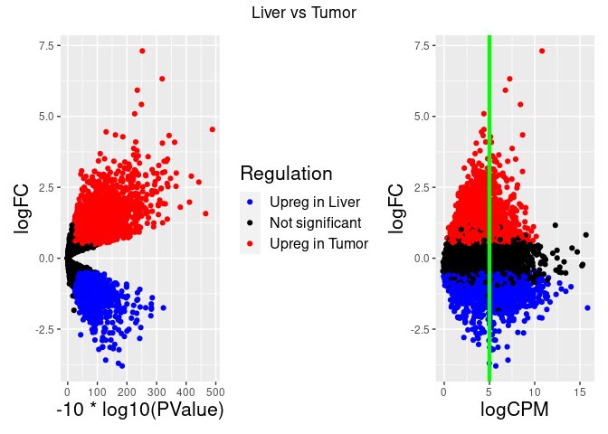<!-- -->


On this plot green line represents the cutoff by average logCPM to drop low expressing genes

## Hierarchal clustrize


```r
li1 <- LivT[li,]
keep <- rownames(li1[li1$table$logCPM > 5,])
keep <- rownames(LivT[keep,])

pedist <- Dist(t(Expr.filt$counts[keep,which(groups == 'T')]), method = 'abscorrelation')
hc <- hclust(pedist)

new_labels <- regexpr(hc$labels, pattern= '([0-9]+op[12])')
new_labels <- regmatches(hc$labels, new_labels)
hc$labels <- new_labels
```


```r
plot(hc, hang = -1)
```

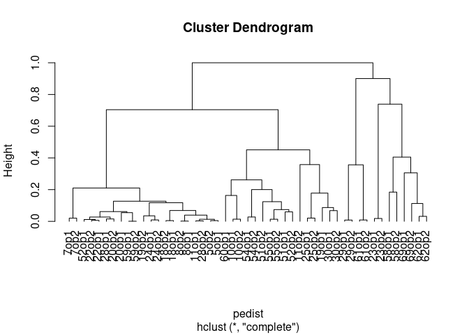<!-- -->

I decided to divide my samples into two clusters. Because samples of different patients don't mix between these clusters. So, the difference between them may be due to differences between patients.


```r
hc <- hclust(pedist)
memb <- cutree(hc, k = 2)
names(memb) <- hc$labels

newgroups <- as.data.frame(groups)
rownames(newgroups) <- colnames(Expr.filt)
newgroups[names(memb[memb == 1]),] = 'T1'
newgroups[names(memb[memb == 2]),] = 'T2'
```


```r
cluster1 <- unique(groupstab[names(memb[memb == 1]),'patient_number'])
cluster2 <- unique(groupstab[names(memb[memb == 2]),'patient_number'])
cluster1 <- rownames(groupstab[groupstab$patient_number %in% cluster1,])
cluster2 <- rownames(groupstab[groupstab$patient_number %in% cluster2,])
```


```r
createclust <- function(cluster){
  Clust1 <- setdiff(colnames(Expr.filt), cluster)
  clust1 <- as.data.frame(groups)
  rownames(clust1) <- colnames(Expr.filt)
  clust1 <- clust1[Clust1,]
  Clust1  <- DGEList(Expr[rownames(Expr.filt),Clust1], 
                       samples = Clust1,
                       genes = rownames(Expr.filt),
                       group = unlist(clust1, use.names = FALSE))
  Clust1 <- Clust1[filterByExpr.DGEList(Clust1),]
  Clust1 <- calcNormFactors(Clust1,method = 'TMM')
  Clust1 <- estimateCommonDisp(Clust1,verbose = T)
  Clust1 <- estimateTagwiseDisp(Clust1)
  Clust1
}
```


```r
Clust1 <- createclust(cluster2)
```

```
## Disp = 0.30966 , BCV = 0.5565
```

```r
Clust2 <- createclust(cluster1)
```

```
## Disp = 0.31897 , BCV = 0.5648
```


```r
#pdf('Slide10.pdf', width=15, height=7)
cols1 <- c('Tumor1' = 'red',
          'Liver1' = 'blue',
          'Hep3B' = 'green4',
          'HUH7' = 'orange',
          'HepG2' = 'purple')
clustg1 <- as.character(dplyr::recode(as.factor(Clust1$samples$group),
                             H7 = 'HUH7', HG2 = 'HepG2',
                             H3B = 'Hep3B', `T` = 'Tumor1',
                             L = 'Liver1'))
clustg1 <- as.data.frame(clustg1)
rownames(clustg1) <- colnames(Clust1)
clustg1 <- clustg1[colnames(Clust1),]
ggp1 <- plotMDS.extended(Clust1, col = cols1, labs = clustg1, labs_ext = clustg1)
cols2 <- c('Tumor2' = 'red',
          'Liver2' = 'blue',
          'Hep3B' = 'green4',
          'HUH7' = 'orange',
          'HepG2' = 'purple')
clustg2 <- as.character(dplyr::recode(as.factor(Clust2$samples$group),
                             H7 = 'HUH7', HG2 = 'HepG2',
                             H3B = 'Hep3B', `T` = 'Tumor2',
                             L = 'Liver2'))
clustg2 <- as.data.frame(clustg2)
rownames(clustg2) <- colnames(Clust2)
clustg2 <- clustg2[colnames(Clust2),]
ggp2 <- plotMDS.extended(Clust2, col = cols2, labs = clustg2, labs_ext = clustg2)
ggp_all <- (ggp1 + ggp2)
ggp_all
```

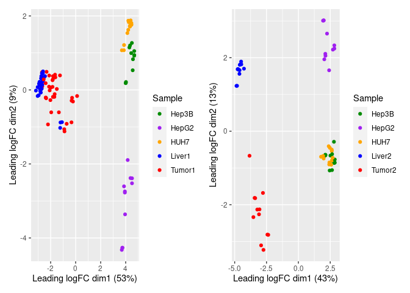<!-- -->

Here you can see the difference in samples distribution on plotMDS between the patients of two clusters.


## Diffexpression of clusters


```r
H3bT1 <- exactTest(Clust1, pair=c(1,5)) 
Hg2T1 <- exactTest(Clust1, pair=c(3,5)) 
HUHT1 <- exactTest(Clust1, pair=c(2,5)) 
LivT1 <- exactTest(Clust1, pair=c(4,5))

H3bT2 <- exactTest(Clust2, pair=c(1,5)) 
Hg2T2 <- exactTest(Clust2, pair=c(3,5)) 
HUHT2 <- exactTest(Clust2, pair=c(2,5)) 
LivT2 <- exactTest(Clust2, pair=c(4,5))
```


```r
volcano <- function(Hg2T, H3bT, HUHT, LivT, logfc, pvals){
hgt <- decideTestsDGE(Hg2T, adjust.method="BH", lfc = logfc[3], p.value= pvals[3])
hbt <- decideTestsDGE(H3bT, adjust.method="BH", lfc = logfc[1], p.value= pvals[1])
hut <- decideTestsDGE(HUHT, adjust.method="BH", lfc = logfc[2], p.value= pvals[2])
lit <- decideTestsDGE(LivT, adjust.method="BH", lfc = logfc[4], p.value= pvals[4])

hb <- rownames(Hg2T)[hbt == 1]
hg <- rownames(H3bT)[hgt == 1]
hu <- rownames(HUHT)[hut == 1]
li <- rownames(LivT)[lit == 1]
return(list("dt1" = hgt,"dt2" = hbt,"dt3" = hut, "dt4" = lit,
            "ch1" = hg, "ch2" = hb,"ch3"= hu,"ch4" = li))}
```

First cluster


```r
pvals <- c(0.001,0.001,0.001,0.01)
logfc <- c(4,4,4,2)
results1 <- volcano(Hg2T1,H3bT1,HUHT1, LivT1, logfc, pvals)
```

Second cluster


```r
pvals <- c(0.001,0.001,0.001,0.005)
logfc <- c(4,4,4,2)
results2 <- volcano(Hg2T2,H3bT2,HUHT2, LivT2, logfc, pvals)
```


```r
ggp1 <- volcplot(LivT1, name = 'Liver1 vs Tumor1', logfc = 2, pval = 0.01, rotate = F)
ggp2 <- volcplot(LivT2, name = 'Liver2 vs Tumor2', logfc = 2, pval = 0.005, rotate = F)
ggp3 <- volcplot(Hg2T1, name = 'HepG2 vs Tumor1', logfc = 4, pval = 0.001,
                 color_lab = c('purple', 'black', 'red'), rotate = F)
ggp4 <- volcplot(Hg2T2, name = 'HepG2 vs Tumor2', logfc = 4, pval = 0.001,
                 color_lab = c('purple', 'black', 'red'), rotate = F)
```

Volcano plots of differential expression:


```r
ggp1
```

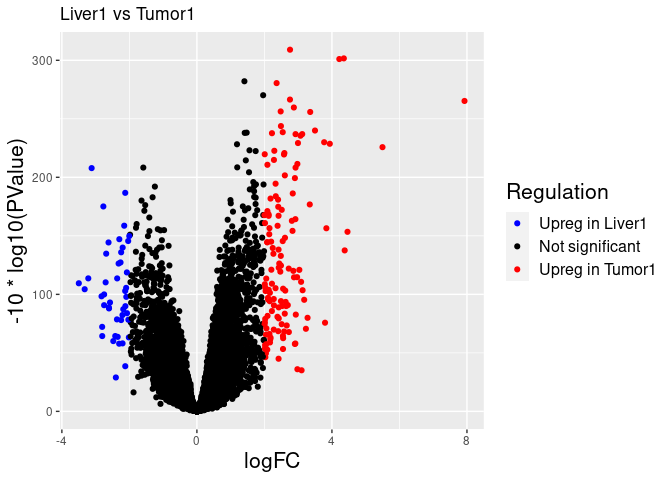<!-- -->

```r
ggp2
```

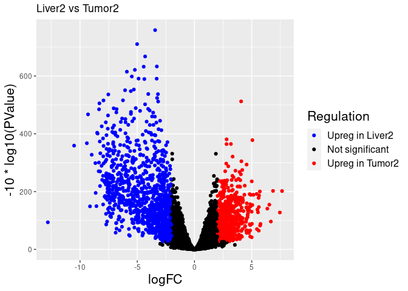<!-- -->

```r
ggp3
```

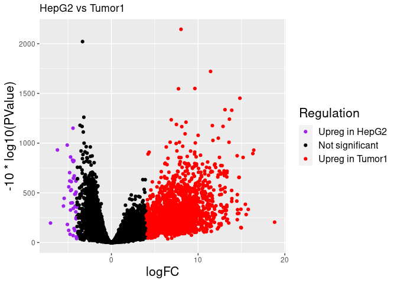<!-- -->

```r
ggp4
```

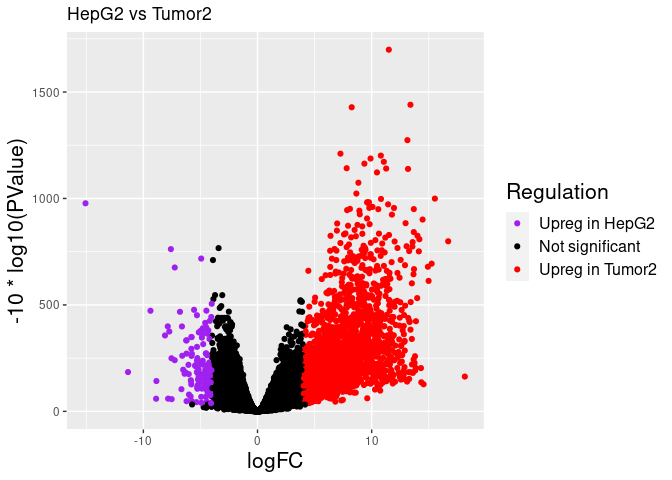<!-- -->


## GSEA


```r
library(clusterProfiler)
library(enrichplot)
library(ggplot2)
organism = "org.Hs.eg.db"
library(organism, character.only = TRUE)
```

This is z-score filter to drop the genes that does not have regular expression in


```r
T_filt <- cpm(Expr.filt)
T_filt <- t(apply(T_filt, 1, function (x) mosaic::zscore(x)))
T_filt <- rownames(T_filt[rowSums(T_filt[,rownames(groupstab[groupstab$sample_type == 'op',])] >= 0.1) > 30,])
```


```r
hg <- results1[["ch1"]]
hb <- results1[["ch2"]]
hu <- results1[["ch3"]]
li <- results1[["ch4"]]
keep1 <- intersect(intersect(li,hg),intersect(hb,hu))
GL1 <- LivT1$table[keep1,'logFC']
names(GL1) <- keep1
GL1 <- sort(GL1, decreasing = T)
hg <- results2[["ch1"]]
hb <- results2[["ch2"]]
hu <- results2[["ch3"]]
li <- results2[["ch4"]]
keep2 <- intersect(intersect(li,hg),intersect(hb,hu))
GL2 <- LivT2$table[keep2,'logFC']
names(GL2) <- keep2
GL2 <- sort(GL2, decreasing = T)
```

Tumor1 vs Liver1 


```r
gse1 <- gseGO(geneList=GL1, 
             ont ="ALL", 
             keyType = "ENSEMBL", 
             nPerm = 10000, 
             minGSSize = 1, 
             maxGSSize = 800, 
             pvalueCutoff = 0.01, 
             verbose = TRUE, 
             OrgDb = organism, 
             pAdjustMethod = "none", seed = TRUE)
enrichplot::dotplot(gse1, showCategory=20, split=".sign") + facet_grid(.~.sign)
```

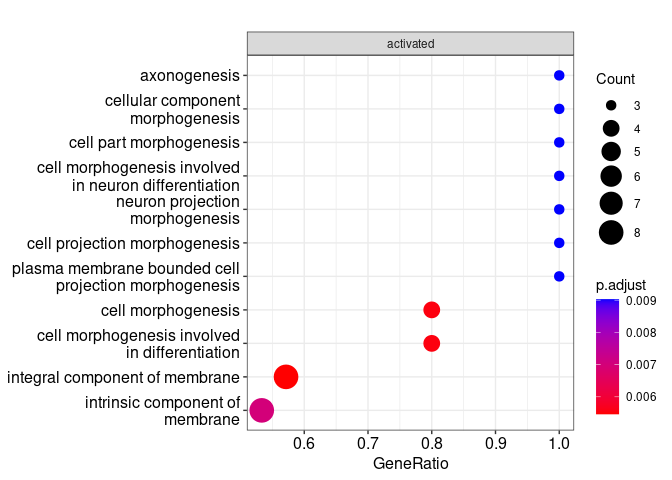<!-- -->

Tumor2 vs Liver2


```r
gse2 <- gseGO(geneList=GL2, 
             ont ="ALL", 
             keyType = "ENSEMBL", 
             nPerm = 10000, 
             minGSSize = 1, 
             maxGSSize = 800, 
             pvalueCutoff = 0.01, 
             verbose = TRUE, 
             OrgDb = organism, 
             pAdjustMethod = "none", seed = TRUE)
enrichplot::dotplot(gse2, showCategory=10, split=".sign") + facet_grid(.~.sign)
```

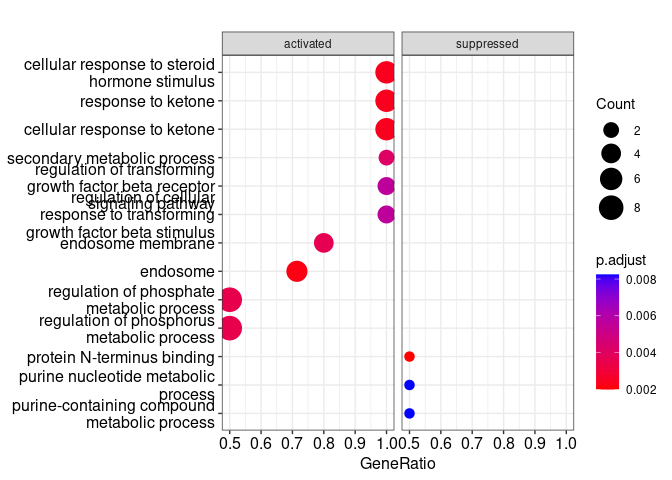<!-- -->

Tumor1 vs HepG2


```r
GL3 <- Hg2T1$table[keep1,'logFC']
names(GL3) <- keep1
GL3 <- sort(GL3, decreasing = T)
GL4 <- Hg2T2$table[keep2,'logFC']
names(GL4) <- keep2
GL4 <- sort(GL4, decreasing = T)
gse3 <- gseGO(geneList=GL3, 
             ont ="ALL", 
             keyType = "ENSEMBL", 
             nPerm = 10000, 
             minGSSize = 1, 
             maxGSSize = 800, 
             pvalueCutoff = 0.01, 
             verbose = TRUE, 
             OrgDb = organism, 
             pAdjustMethod = "none", seed = TRUE)
enrichplot::dotplot(gse3, showCategory=10, split=".sign") + facet_grid(.~.sign)
```

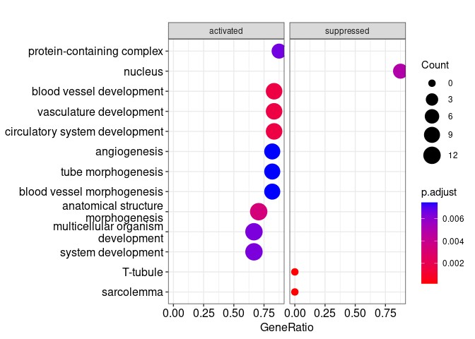<!-- -->

Tumor2 vs HepG2


```r
gse4 <- gseGO(geneList=GL4, 
             ont ="ALL", 
             keyType = "ENSEMBL", 
             nPerm = 10000, 
             minGSSize = 1, 
             maxGSSize = 800, 
             pvalueCutoff = 0.01, 
             verbose = TRUE, 
             OrgDb = organism, 
             pAdjustMethod = "none", seed = TRUE) # 
enrichplot::dotplot(gse4, showCategory=10, split=".sign") + facet_grid(.~.sign) # Tumor2 vs HepG2
```

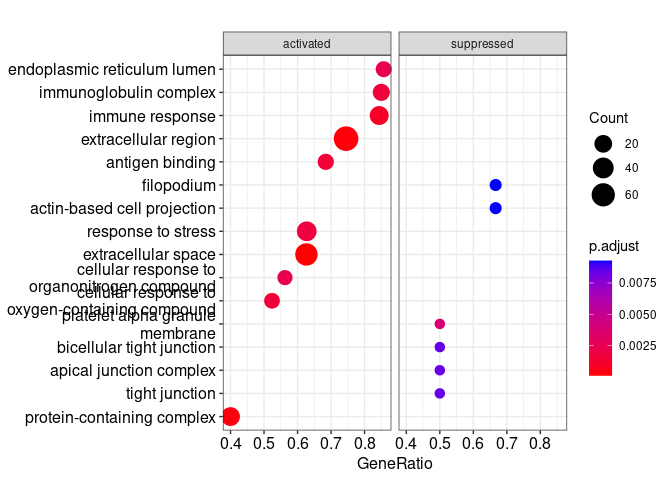<!-- -->


Heatmap of gene expression z-score


```r
library(pheatmap)
library(wordspace)
clust_gr<- as.character(dplyr::recode(as.factor(newgroups[colnames(Expr.filt),]),
                             H7 = 'HUH7', HG2 = 'HepG2',
                             H3B = 'Hep3B', T1 = 'Tumor1',
                             L = 'Liver', T2 = 'Tumor2'))
geneheatmap <- function(data, genes,name = ''){
  heatexp <- as.matrix(data[genes,])
  #head(heatexp)
  groups <- clust_gr
  groups <- as.data.frame(groups, row.names = colnames(Expr.filt))
  heatexp <- t(apply(heatexp, 1, function (x) mosaic::zscore(x)))
  genes <- Expr_gene_an[genes]
  rownames(heatexp) <- genes
  my_colour = list(groups = c(Tumor1 = "cyan1", Tumor2 = "blue4",
                              Liver = "red", HepG2 = "purple",
                              Hep3B ="green4", HUH7 = "orange"))
  pheatmap(
    heatexp/10,
    cluster_rows=T, cluster_cols=F,
    annotation_colors = my_colour,
    #width=14, height=7,
    show_rownames=T,show_colnames = F,
    annotation_col = groups, main = name, treeheight_row = 0)
}
```


```r
name_list <- as.character(Expr.filt$samples$group) 
names(name_list) <- Expr.filt$samples$samples
name_list[names(memb[memb == 1])] <- "T1"
name_list[names(memb[memb == 2])] <- "T2"
name_list <- sort(name_list)
keeps <- intersect(keep1,keep2)
```


```r
geneheatmap(Expr.filt$counts[,names(name_list)], keeps, name = "markers")
```

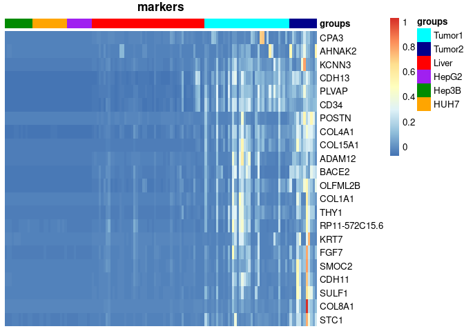<!-- -->


```r
keeps <- intersect(keeps, T_filt)
geneheatmap(Expr.filt$counts[,names(name_list)], keeps, name = "markers")
```

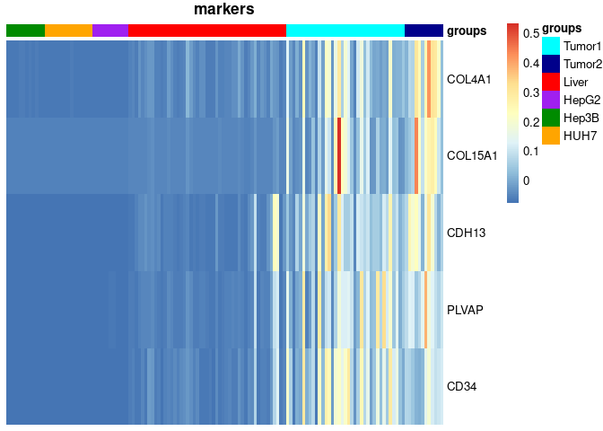<!-- -->
